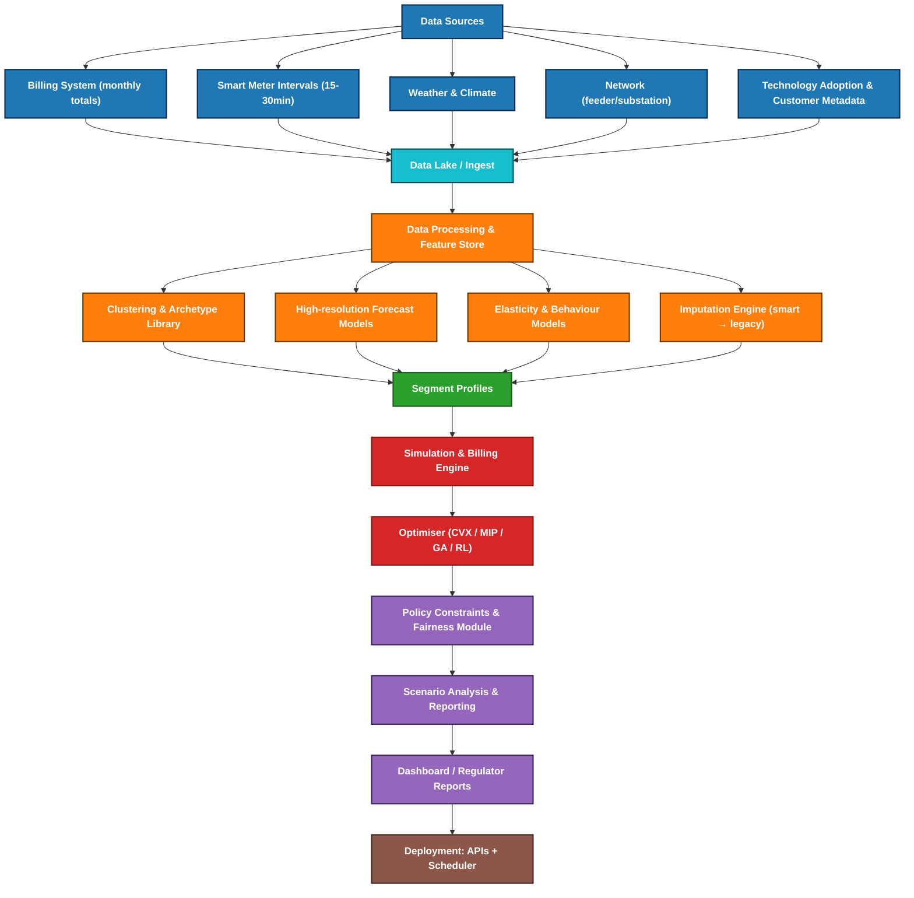

# Tariff_Optimisation
Synergy Tariff optimisation (PoC)
---

```mermaid
flowchart TD
    %% === Data Sources ===
    A["Data Sources"]:::source --> A1["Billing System (monthly totals)"]:::source
    A --> A2["Smart Meter Intervals (15-30min)"]:::source
    A --> A3["Weather & Climate"]:::source
    A --> A4["Network (feeder/substation)"]:::source
    A --> A5["Technology Adoption & Customer Metadata"]:::source

    %% === Data Lake ===
    A1 --> B["Data Lake / Ingest"]:::lake
    A2 --> B
    A3 --> B
    A4 --> B
    A5 --> B

    %% === Processing & Feature Store ===
    B --> C["Data Processing & Feature Store"]:::process
    C --> D1["Clustering & Archetype Library"]:::process
    C --> D2["High-resolution Forecast Models"]:::process
    C --> D3["Elasticity & Behaviour Models"]:::process
    C --> D4["Imputation Engine (smart → legacy)"]:::process

    %% === Segment Profiles ===
    D1 --> E["Segment Profiles"]:::segment
    D2 --> E
    D3 --> E
    D4 --> E

    %% === Simulation & Optimisation ===
    E --> F["Simulation & Billing Engine"]:::engine
    F --> G["Optimiser (CVX / MIP / GA / RL)"]:::engine

    %% === Policy & Reporting ===
    G --> H["Policy Constraints & Fairness Module"]:::policy
    H --> I["Scenario Analysis & Reporting"]:::policy
    I --> J["Dashboard / Regulator Reports"]:::policy
    J --> K["Deployment: APIs + Scheduler"]:::deploy

    %% === Styling ===
    classDef source fill:#1f77b4,stroke:#0c2c55,stroke-width:2px,color:#ffffff,font-weight:bold;
    classDef lake fill:#17becf,stroke:#0a4a4e,stroke-width:2px,color:#ffffff,font-weight:bold;
    classDef process fill:#ff7f0e,stroke:#663c00,stroke-width:2px,color:#ffffff,font-weight:bold;
    classDef segment fill:#2ca02c,stroke:#1b5d1b,stroke-width:2px,color:#ffffff,font-weight:bold;
    classDef engine fill:#d62728,stroke:#7f1b1b,stroke-width:2px,color:#ffffff,font-weight:bold;
    classDef policy fill:#9467bd,stroke:#3e265c,stroke-width:2px,color:#ffffff,font-weight:bold;
    classDef deploy fill:#8c564b,stroke:#402a25,stroke-width:2px,color:#ffffff,font-weight:bold;

```